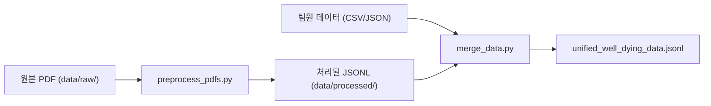
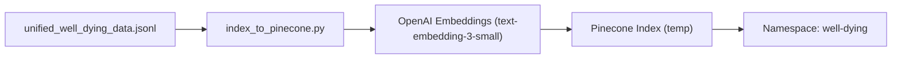
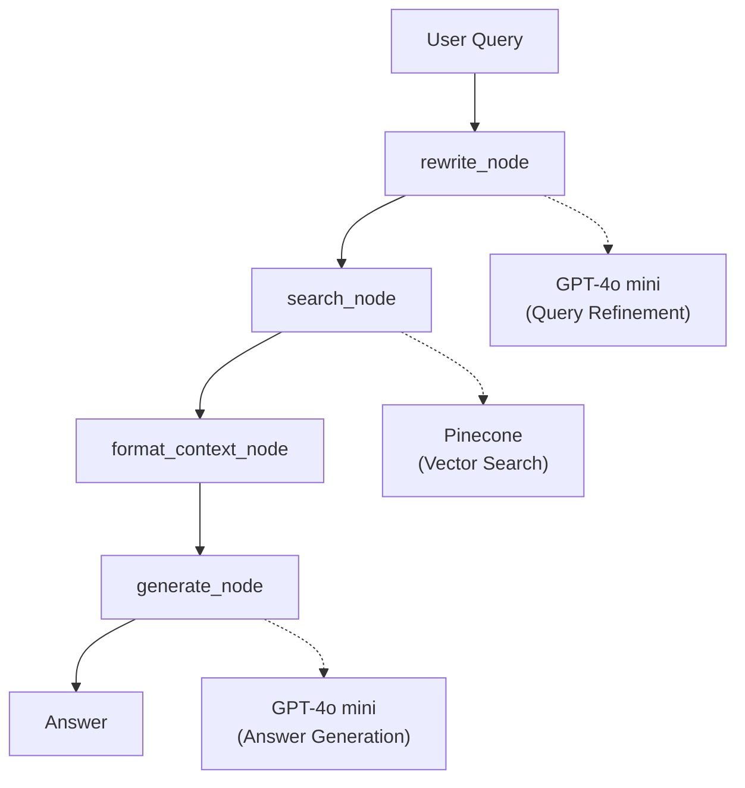

# Well Dying 정보 챗봇

Well Dying(웰다잉) 주제에 대한 포괄적인 정보를 제공하는 RAG(Retrieval-Augmented Generation) 기반 챗봇 시스템입니다.

**✨ LangGraph 기반 워크플로우로 구현되었으며, Pinecone 벡터 DB를 사용합니다.**

---

## 📖 프로젝트 개요

이 프로젝트는 **Well Dying(존엄한 삶의 마무리)**을 주제로, 사용자에게 다음과 같은 정보를 제공합니다:
- 🏛️ **유산상속 관련 법률** (민법, 상속세법 등)
- ⚰️ **장례절차 및 장례식장 정보** (전국 장례식장 데이터베이스)
- 💰 **정부 지원금** (사망 시 지원금, 상속 관련 혜택)
- 💻 **디지털 유산 관리** (사이버 유산, 계정 관리)

### 주요 특징

- 🤖 **RAG 기반 답변**: GPT-4o mini와 Pinecone 벡터 검색을 결합하여 정확한 답변 생성
- 🧠 **대화 기록 유지**: LangGraph MemorySaver를 통한 컨텍스트 인식 대화
- 🔍 **쿼리 재작성**: 모호한 질문을 구체적인 검색 키워드로 자동 변환
- 💬 **Well Dying 톤앤매너**: 차분하고 담백한 상담 스타일
- 🌐 **웹 인터페이스**: Streamlit 기반의 사용자 친화적 UI
- 📊 **통합 데이터**: 4개 카테고리(Cyber Legacy, Subsidy, Funeral, Persona)의 2,754개 데이터

---

## 📋 프로젝트 구조

```
.
├── chatbot/                    # 챗봇 애플리케이션
│   ├── app.py                  # Streamlit 웹 인터페이스
│   └── src/
│       ├── chatbot.py          # RAG 챗봇 (LangGraph)
│       ├── preprocessing.py    # PDF 전처리
│       └── indexer.py          # ChromaDB 인덱싱 (레거시)
│
├── data/                       # 데이터 저장소
│   ├── raw/                    # 원본 PDF 파일
│   ├── processed/              # 전처리된 JSONL 파일
│   │   ├── unified_well_dying_data.jsonl  # 통합 데이터
│   │   └── *.jsonl             # 개별 처리 파일
│   └── chroma_db/              # ChromaDB (미사용)
│
├── scripts/                    # 유틸리티 스크립트
│   ├── merge_data.py           # 데이터 통합 스크립트
│   ├── index_to_pinecone.py    # Pinecone 인덱싱
│   ├── analyze_pdfs.py         # PDF 분석
│   └── validate_data.py        # 데이터 검증
│
├── tests/                      # 테스트 스크립트
│   ├── test_memory.py          # 대화 기록 테스트
│   ├── test_retrieval.py       # 검색 테스트
│   ├── test_general.py         # 일반 쿼리 테스트
│   └── test_preprocessing.py   # 전처리 테스트
│
├── requirements.txt            # Python 패키지 의존성
├── .env                        # 환경 변수 (API Keys)
└── README.md                   # 프로젝트 문서 (본 파일)
```

---

## 🔄 전체 워크플로우

### 1. 데이터 준비 단계



**데이터 카테고리:**
- **Cyber Legacy** (사이버 유산): 온라인 계정 관리, 디지털 유산
- **Subsidy** (정부 지원금): 장례 지원금, 상속 관련 혜택
- **Funeral** (장례 절차): 전국 장례식장, 무덤, 화장터 정보
- **Persona** (톤앤매너): 대화 규칙, 공감 질문

### 2. 인덱싱 단계



**Pinecone 구조:**
- **Index Name**: `temp`
- **Namespace**: `well-dying` (팀원 데이터와 분리)
- **Dimension**: 1536 (text-embedding-3-small)
- **Metric**: cosine similarity

### 3. 챗봇 실행 단계 (LangGraph Workflow)



**LangGraph 노드 설명:**
1. **rewrite_node**: 사용자 질문을 검색에 최적화된 형태로 재작성
2. **search_node**: Pinecone에서 유사 문서 검색 (Top 15)
3. **format_context_node**: 검색된 문서를 컨텍스트로 구성
4. **generate_node**: 컨텍스트 기반 답변 생성 + 대화 기록 업데이트

---

## 🛠️ 기술 스택

### 데이터 처리
- **PyMuPDF (fitz)**: PDF 텍스트 추출
- **Pandas**: CSV/JSON 데이터 처리
- **Python 3.11+**: 주요 프로그래밍 언어

### 벡터 데이터베이스
- **Pinecone**: 클라우드 벡터 DB (Serverless)
- **OpenAI Embeddings**: `text-embedding-3-small` 모델 (1536 차원)

### LLM & 챗봇
- **OpenAI GPT-4o mini**: 답변 생성 및 쿼리 재작성
- **LangGraph**: 워크플로우 관리 및 상태 관리
- **LangChain**: LLM 통합 및 체인 구성
- **MemorySaver**: 대화 기록 유지 (세션별 thread_id)

### 웹 인터페이스
- **Streamlit**: 웹 UI 프레임워크

### 환경 관리
- **python-dotenv**: 환경 변수 관리

---

## 🚀 시작하기

### 1. 환경 설정

```bash
# 1. 가상환경 생성 및 활성화
python -m venv .venv
source .venv/bin/activate  # Mac/Linux
# .venv\Scripts\activate  # Windows

# 2. 패키지 설치
pip install -r requirements.txt

# 3. 환경 변수 설정 (.env 파일 생성)
echo "OPENAI_API_KEY=your_openai_api_key" > .env
echo "PINECONE_API_KEY=your_pinecone_api_key" >> .env
```

### 2. 데이터 준비 (선택사항)

**이미 `unified_well_dying_data.jsonl`이 있다면 이 단계는 건너뛰세요.**

```bash
# PDF 전처리 (data/raw/ -> data/processed/)
python chatbot/src/preprocessing.py

# 데이터 통합 (여러 소스 -> unified_well_dying_data.jsonl)
python scripts/merge_data.py
```

### 3. Pinecone 인덱싱

```bash
# Pinecone에 데이터 업로드 (최초 1회 또는 데이터 변경 시)
python scripts/index_to_pinecone.py
```

**예상 소요 시간:** 약 10-15분 (2,754개 문서 기준)

### 4. 챗봇 실행

```bash
# Streamlit 앱 실행
streamlit run chatbot/app.py

# 또는 포트 지정
streamlit run chatbot/app.py --server.port 8503
```

브라우저에서 `http://localhost:8501` (또는 지정한 포트) 접속

---

## 💡 사용 예시

### 질문 예시

1. **유산상속 관련**
   - "상속세율이 얼마야?"
   - "상속 재산을 조회하려면 어떻게 해야 해?"

2. **장례절차 관련**
   - "마포구 장례식장 알려줘"
   - "화장 절차는 어떻게 되나요?"

3. **정부 지원금**
   - "장례비 지원금은 얼마야?"
   - "유족에게 지급되는 지원금이 있나요?"

4. **디지털 유산**
   - "카카오톡 계정 탈퇴 방법 알려줘"
   - "구글 계정 추모 프로필은 뭐야?"

### 대화 기록 유지

챗봇은 세션별로 대화 기록을 유지합니다:
- **같은 브라우저 탭**: 이전 대화 컨텍스트 유지
- **새 탭/브라우저**: 새로운 세션으로 시작
- **기록 초기화**: 사이드바의 "🗑️ 대화 기록 지우기" 버튼 클릭

---

## 🧪 테스트

```bash
# 대화 기록 테스트
python tests/test_memory.py

# 검색 기능 테스트
python tests/test_retrieval.py

# 일반 쿼리 테스트
python tests/test_general.py

# 전처리 로직 테스트
python tests/test_preprocessing.py
```

---

## 📊 데이터 통계

- **총 문서 수**: 2,754개
- **카테고리 분포**:
  - Cyber Legacy: ~500개
  - Subsidy: ~1,200개
  - Funeral: ~1,000개
  - Persona: ~50개 (중복 제거 후)
- **평균 문서 길이**: ~300자
- **인덱싱 성공률**: 99.96% (1개 초과 길이 오류)

---

## ⚙️ 설정 및 튜닝

### 검색 파라미터 (`chatbot/src/chatbot.py`)

```python
# 검색 결과 수 (Recall vs. 응답 속도 트레이드오프)
n_results = 15  # 기본값

# Pinecone 설정
INDEX_NAME = "temp"
NAMESPACE = "well-dying"
```

### LLM 파라미터

```python
# GPT-4o mini 설정
llm = ChatOpenAI(
    model="gpt-4o-mini",
    temperature=0.7,      # 창의성 vs. 일관성
    max_tokens=1000,      # 최대 응답 길이
)
```

### 쿼리 재작성 활성화/비활성화

`chatbot/src/chatbot.py`의 LangGraph 워크플로우에서 `rewrite_node`를 제거하면 쿼리 재작성 없이 직접 검색합니다.

---

## 🔒 보안 및 환경 변수

**`.env` 파일 예시:**

```bash
OPENAI_API_KEY=sk-proj-...
PINECONE_API_KEY=pcsk_...
```

**주의사항:**
- `.env` 파일은 `.gitignore`에 포함되어 있습니다.
- API Key는 절대 공개 저장소에 커밋하지 마세요.
- Production 환경에서는 환경 변수 관리 시스템 사용 권장.

---

## 🐛 트러블슈팅

### 1. Pinecone 인덱스 한도 초과

**오류:**
```
Request failed. You've reached the max serverless indexes allowed in project Default (5).
```

**해결:**
- Pinecone 콘솔에서 불필요한 인덱스 삭제
- 또는 기존 인덱스의 Namespace를 활용 (현재 방식)

### 2. OpenAI API Rate Limit

**오류:**
```
Rate limit reached for requests
```

**해결:**
- `scripts/index_to_pinecone.py`의 `time.sleep(0.5)` 값 증가
- OpenAI API Tier 업그레이드

### 3. 검색 결과가 부정확함

**해결:**
1. `n_results` 값 증가 (15 → 20)
2. 쿼리 재작성 프롬프트 튜닝 (`rewrite_node` 참고)
3. 임베딩 모델 변경 고려 (`text-embedding-3-large`)

### 4. Streamlit 앱이 변경사항을 반영하지 않음

**해결:**
- 브라우저 새로고침 (F5)
- Streamlit 우측 상단 "Always rerun" 클릭
- 터미널에서 Streamlit 재시작 (Ctrl+C 후 재실행)

---

## 📚 참고 자료

### 데이터 출처
- **법률 문서**: 민법 상속편, 상속세 및 증여세법
- **세금 안내**: 국세청 상속·증여 세금상식 I, II
- **장례 정보**: 전국 장례식장, 화장터, 묘지 데이터베이스
- **디지털 유산**: 카카오, 구글, 네이버 계정 관리 가이드

### 관련 문서
- [RAG_DATA_PREPROCESSING_GUIDE.md](RAG_DATA_PREPROCESSING_GUIDE.md): 데이터 전처리 가이드
- [LangGraph 공식 문서](https://langchain-ai.github.io/langgraph/)
- [Pinecone 문서](https://docs.pinecone.io/)

---

## 🤝 기여

이 프로젝트는 Well Dying 팀 프로젝트의 일부입니다.

**팀원 데이터 통합 프로세스:**
1. `data/processed/` 하위에 카테고리별 폴더 생성 (예: `online_pjh_json/`)
2. CSV 또는 JSON 데이터 배치
3. `scripts/merge_data.py` 실행
4. `scripts/index_to_pinecone.py` 실행

---

## 📝 라이선스

내부 프로젝트용

---

## 📞 문의

프로젝트 관련 문의사항은 팀 채널을 통해 공유해주세요.
