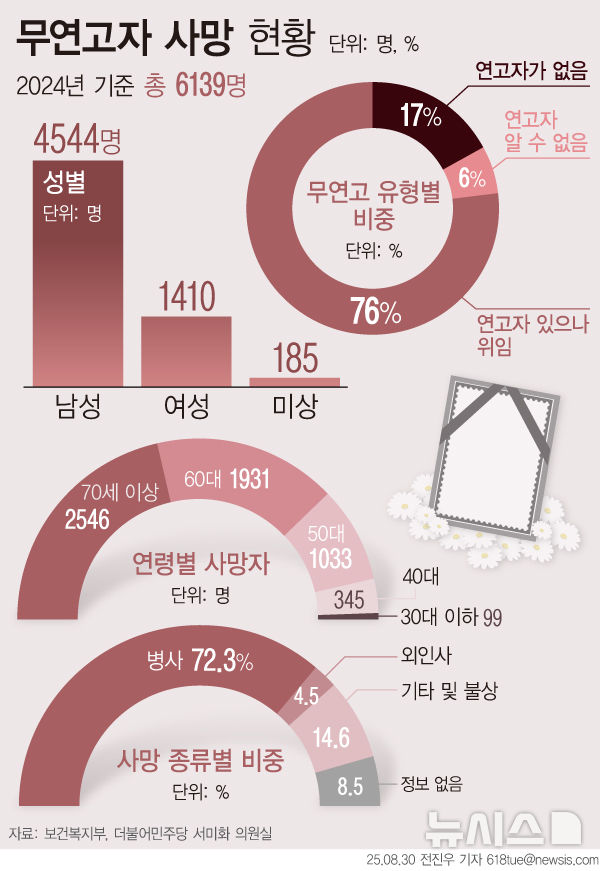
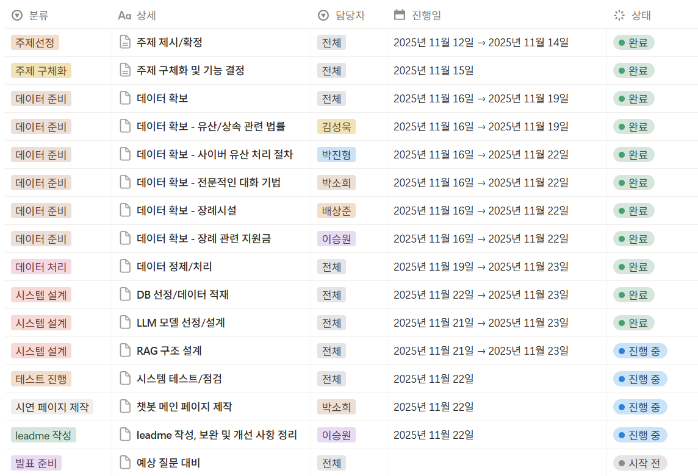

# SKN19-3rd-3TEAM

> SK네트웍스 Family AI 캠프 19기 3차 프로젝트  
> 개발기간: 25.11.12 ~ 25.11.25 <br>
> 주제 : LLM을 연동한 내외부 문서 기반 질의 응답 시스템

<br>

---

# 📚 목차

1. [팀 소개](#%EF%B8%8F-%ED%8C%80-%EC%86%8C%EA%B0%9C)
2. [프로젝트 개요](#-%ED%94%84%EB%A1%9C%EC%A0%9D%ED%8A%B8-%EA%B0%9C%EC%9A%94)
3. [기술 스택 & 사용한 모델](#-%EA%B8%B0%EC%88%A0-%EC%8A%A4%ED%83%9D--%EC%82%AC%EC%9A%A9%ED%95%9C-%EB%AA%A8%EB%8D%B8)
4. [시스템 아키텍처](#%EC%8B%9C%EC%8A%A4%ED%85%9C-%EC%95%84%ED%82%A4%ED%85%8D%EC%B2%98)
5. [WBS](#-wbs)
6. [요구사항 명세서](#%EF%B8%8F%E2%83%A3-%EC%9A%94%EA%B5%AC%EC%82%AC%ED%95%AD-%EB%AA%85%EC%84%B8%EC%84%9C)
7. [수집한 데이터 및 전처리 요약](#%EF%B8%8F-%EC%88%98%EC%A7%91%ED%95%9C-%EB%8D%B0%EC%9D%B4%ED%84%B0-%EB%B0%8F-%EC%A0%84%EC%B2%98%EB%A6%AC-%EC%9A%94%EC%95%BD)
8. [DB 연동 구현 코드](#db-%EC%97%B0%EB%8F%99-%EA%B5%AC%ED%98%84-%EC%BD%94%EB%93%9C)
9. [테스트 계획 및 결과 보고서](#-%ED%85%8C%EC%8A%A4%ED%8A%B8-%EA%B3%84%ED%9A%8D-%EB%B0%8F-%EA%B2%B0%EA%B3%BC-%EB%B3%B4%EA%B3%A0%EC%84%9C)
10. [트러블 슈팅](#-%ED%8A%B8%EB%9F%AC%EB%B8%94%EC%8A%88%ED%8C%85)
11. [수행결과(시연 페이지)](#-%EC%88%98%ED%96%89%EA%B2%B0%EA%B3%BC%EC%8B%9C%EC%97%B0-%ED%8E%98%EC%9D%B4%EC%A7%80)
12. [한 줄 회고](#%EF%B8%8F-%ED%95%9C-%EC%A4%84-%ED%9A%8C%EA%B3%A0)

<br>

---

# 🖐️ 팀 소개

- ## 팀명 : **맺음**
- ### 팀원 소개 :

<div align="center">
	
| [@배상준](https://github.com/WindyAle) | [@박소희](https://github.com/xxoysauce) | [@이승원](https://github.com/seungwon-sw) | [@김성욱](https://github.com/souluk319) | [@박진형](https://github.com/vispi94) |
| :----------------------------------------: | :----------------------------------------: | :----------------------------------------: | :----------------------------------------: | :----------------------------------------: |
|  |  |  |  |  |

</div>

<br>

---

# 📖 프로젝트 개요

##  주제 : 남은 인생을 후회 없이 잘 살고, 품위 있는 끝맺음을 준비하며, <br> 새로운 삶의 의미를 찾아가는 과정을 돕는 AI 기반의 '대화 상대' 챗봇 서비스

- ###  **프로젝트 소개**

"**라잎클로버**"는 사용자가 남은 삶을 정돈하고 의미를 찾을 수 있도록 돕는 AI 대화형 챗봇 서비스입니다.  
**상속, 장례 절차, 디지털 유산, 정서 상담 등 다양한 주제를 RAG 기반으로 안내**하며  
**사용자의 감정·기억까지 반영된 맞춤형 대화를 제공**합니다.

- ###  **프로젝트 배경**

"삶의 마무리 과정(상속·장례·연명의료 등)에 대한 정보 수요가 증가하고 있지만,<br>
궁금한 정보를 다양하게 제공하거나 정서적 부담으로 주변에 쉽게 이야기하기 어려운 고민을<br>
한 곳에서 상담/안내해주는 통합 서비스는 부족합니다."

- **현대 사회 이슈**
   -   고령화 사회 심화
   -   독거노인 + 1인 가구 증가
   -   무연고자 사망 증가

## 관련 기사

### ■ 무연고 사망 증가



- 무연고 사망자는 년마다 증가하는 추세이며, 통계에 잡히지 않는 불특정 다수도 있어 관심과 대책이 요망됨.

[https://www.newsis.com/view/NISX20250905_0003318050?utm_source=chatgpt.com](https://www.newsis.com/view/NISX20250905_0003318050?utm_source=chatgpt.com)
##### 출처: 뉴시스


### ■ 고령화 + 1인 가구


-   한국은 2025년 초고령사회 진입.
    
-   노년층 1인 가구 폭증 → 죽음 준비·장례 절차의 정보 접근성 낮음.    
[https://kostat.go.kr/portal/korea/kor_nw/1/1/index.board?bmode=read&aSeq=429567?utm_source=chatgpt.com](https://kostat.go.kr/portal/korea/kor_nw/1/1/index.board?bmode=read&aSeq=429567?utm_source=chatgpt.com)
##### 출처: 통계청

## 해외 죽음 준비 문화 동향
	
### ■ 일본의 ‘슈카츠(終活, Shukatsu)’ 확산

-   일본에서는 **자기 죽음을 준비하는 활동 전체**를 가리키는 말로 ‘슈카츠(終活)’가 이미 널리 사용됨. [위키백과](https://en.wikipedia.org/wiki/Shukatsu_%28end-of-life_planning%29?utm_source=chatgpt.com)

-   주체적인 삶의 마무리, 남겨진 가족의 부담 경감, 현재 삶의 재발견과 성찰, 물리적 정리를 대비하는 문화<br>
   Shukatsu 개념 정리(위키피디아) <br>
   [](https://en.wikipedia.org/wiki/Shukatsu_(end-of-life_planning))[https://en.wikipedia.org/wiki/Shukatsu_(end-of-life_planning)](https://en.wikipedia.org/wiki/Shukatsu_(end-of-life_planning))

### ■ 미국 – Legacy AI / Digital Afterlife 시장 등장

- “StoryWorth”: AI 기반 인생 회고 스토리북 생성 서비스 → 미국에서 급성장.
    
    출처: StoryWorth 공식
    
    https://welcome.storyworth.com/?utm_source=chatgpt.com
    
- “HereAfter AI”: AI가 사용자의 생전 음성·이야기를 기록 → 유족이 대화 가능.
    
    출처: HereAfter
    
    https://www.hereafter.ai/?utm_source=chatgpt.com

<br>
	
### "이러한 배경에서 저희는 **신뢰할 수 있는 안내/대화 서비스의 필요성**을 느끼고 도움을 줄 수 있는 챗봇을 구상하게 되었습니다."

- ### **프로젝트 목표**

1.  **핵심 정보 제공**: 상속·장례·디지털 유산 등 삶의 마무리에 필요한 정보를 정확하게 안내
    
2.  **맞춤형 대화**: 감정·기억을 반영한 개인화된 상담 제공
    
3.  **RAG 기반 정확성 향상**: GPT-4o mini + Pinecone으로 근거 기반 답변 생성
    
4.  **사용자 중심 UI 구현**: (여기에 구현 프로그램 명 입력) 을 사용한 모바일 최적화 인터페이스로 간편한 이용 환경 제공

<br>

---

# 💻 기술 스택 & 사용한 모델  

| 분야                | 사용 도구 |
|---------------------|-----------|
| **Language**        | [](https://www.python.org/) |
| **Collaboration Tool** | [](https://git-scm.com/) [](https://github.com/) [](https://www.notion.so/) [](https://discord.com/) |
| **LLM Model**       | [](https://platform.openai.com/) 
| **Embedding Model** | [](https://platform.openai.com/docs/guides/embeddings) |
| **Vector DB**       | [](https://www.pinecone.io/) |
| **Orchestration / RAG** | [](https://www.langchain.com/) [](https://langchain-ai.github.io/langgraph/) |
| **Frontend** |  |
| **Development Env** | [](https://code.visualstudio.com/) [](https://www.anaconda.com/) [](https://www.runpod.io/) [](https://colab.research.google.com/) [](https://ai.google.dev/)[](https://platform.openai.com/)


<br>

---

# 🪢시스템 아키텍처

### 프로젝트 구조
(추후 marge한 최종 형태로 갱신 예정)

```
.
├── chatbot/                    # 챗봇 애플리케이션
│   ├── app.py                  # Streamlit 웹 인터페이스
│   └── src/
│       ├── chatbot.py          # RAG 챗봇 (LangGraph)
│       ├── preprocessing.py    # PDF 전처리
│       └── indexer.py          # ChromaDB 인덱싱 (레거시)
│
├── data/                       # 데이터 저장소
│   ├── raw/                    # 원본 PDF 파일
│   ├── processed/              # 전처리된 JSONL 파일
│   │   ├── unified_well_dying_data.jsonl  # 통합 데이터
│   │   └── *.jsonl             # 개별 처리 파일
│   └── chroma_db/              # ChromaDB (미사용)
│
├── scripts/                    # 유틸리티 스크립트
│   ├── merge_data.py           # 데이터 통합 스크립트
│   ├── index_to_pinecone.py    # Pinecone 인덱싱
│   ├── analyze_pdfs.py         # PDF 분석
│   └── validate_data.py        # 데이터 검증
│
├── tests/                      # 테스트 스크립트
│   ├── test_memory.py          # 대화 기록 테스트
│   ├── test_retrieval.py       # 검색 테스트
│   ├── test_general.py         # 일반 쿼리 테스트
│   └── test_preprocessing.py   # 전처리 테스트
│
├── requirements.txt            # Python 패키지 의존성
├── .env                        # 환경 변수 (API Keys)
└── README.md                   # 프로젝트 문서 (본 파일)
```

<br>

### 데이터 준비 단계


**데이터 카테고리:**
- Cyber Legacy (사이버 유산): 온라인 계정 관리, 디지털 유산
- Subsidy (정부 지원금): 장례 지원금, 상속 관련 혜택
- Funeral (장례 절차): 전국 장례식장, 무덤, 화장터 정보
- Persona (톤앤매너): 대화 규칙, 공감 질문

### 인덱싱 단계


**Pinecone 구조:**
- Index Name: temp
- Namespace: well-dying (팀원 데이터와 분리)
- Dimension: 1536 (text-embedding-3-small)
- Metric: cosine similarity

### 챗봇 실행 단계 (LangGraph Workflow)


**LangGraph 노드 설명:**
1. rewrite_node: 사용자 질문을 검색에 최적화된 형태로 재작성
2. search_node: Pinecone에서 유사 문서 검색 (Top 15)
3. format_context_nod: 검색된 문서를 컨텍스트로 구성
4. generate_node: 컨텍스트 기반 답변 생성 + 대화 기록 업데이트

<br>

---

# 📅 WBS



<br>

---

# *️⃣ 요구사항 명세서

이 서비스는 다음과 같은 정보/기능을 제공합니다.<br>
(파트별 추가 내용 1줄씩 보완 예정)
#### 유산상속 관련 법률 기반 정보
- 민법, 상속세법 등
#### 장례절차 및 장례식장 정보
- 전국 장례식장 데이터베이스
#### 디지털 유산 관리 
- 사후 사이버 개인정보, 계정 관리에 대한 정보 제공
- 일부 플랫폼의 사후 처리 기능과 계정 휴면, 탈퇴 절차 및 유의사항 전달
#### 감성적인 대화 
- 사용자 기분 상태에 맞는 공감/대화

<br>

---

# 🗃️ 수집한 데이터 및 전처리 요약

### 수집한 데이터 목록

<details>
<summary>장례 관련</summary>

#### 도움받을 수 있는 연락처

-   장례문화진흥원 02-6930-9300
-   e하늘 장사 관련상담 1577-4129
-   장례지원 비영리단체 나눔과나눔 02-6455-3411

#### 전국 공영 장례
[https://www.15774129.go.kr/portal/counsel/bbs/list.do?menuId=M0009000800000000#{"page":1}](https://www.15774129.go.kr/portal/counsel/bbs/list.do?menuId=M0009000800000000#%7B%22page%22:1%7D)

전국 공영장례 조례집(서울 인천 경기).pdf

전국 화장장려금 조례집.pdf

#### 장례식장 / 화장시설 / 묘지 / 봉안 시설 / 자연 장지 시설 전국 API**
https://www.data.go.kr/data/15122367/openapi.do
https://www.data.go.kr/data/15122369/openapi.do
https://www.data.go.kr/data/15122364/openapi.do
https://www.data.go.kr/data/15122365/openapi.do
https://www.data.go.kr/data/15122366/openapi.do
</details>
<br>
<details>
<summary>유산 관련</summary>

#### 행정안전부_기부관련단체정보서비스 API
    
   [https://www.data.go.kr/data/15000374/openapi.do?recommendDataYn=Y](https://www.data.go.kr/data/15000374/openapi.do?recommendDataYn=Y)
    

----------

#### 한국 노인들의 유산상속 동기
    
   [https://www.kihasa.re.kr/hswr/assets/pdf/1041/journal-37-3-36.pdf](https://www.kihasa.re.kr/hswr/assets/pdf/1041/journal-37-3-36.pdf)
    
####  상속 재산 배분에 미치는 영향 요인 분석
    
   [https://papers.ssrn.com/sol3/papers.cfm?abstract_id=4380371](https://papers.ssrn.com/sol3/papers.cfm?abstract_id=4380371)
    

----------

####   사망자의 디지털 유산(개인정보, 계정, 게시물 등) 처리방안 연구
    
   [https://www.kmcc.go.kr/user.do;jsessionid=sII8tJ2Ye05YDWIfo_qxiCywsFNSflOY3bRFvxmC.servlet-aihgcldhome20?mode=view&page=A02160000&dc=K02160000&boardId=1022&cp=31&nop=10&boardSeq=34052](https://www.kmcc.go.kr/user.do;jsessionid=sII8tJ2Ye05YDWIfo_qxiCywsFNSflOY3bRFvxmC.servlet-aihgcldhome20?mode=view&page=A02160000&dc=K02160000&boardId=1022&cp=31&nop=10&boardSeq=34052)

[https://journal.kiso.or.kr/?p=11475](https://journal.kiso.or.kr/?p=11475)
</details>
<br>
<details>
<summary>사이버 개인정보 처리 관련</summary>

### 카카오톡 :

-   추모 프로필 기능
	[https://www.kakaocorp.com/page/detail/10876?utm_source=chatgpt.com](https://www.kakaocorp.com/page/detail/10876?utm_source=chatgpt.com)

-   카카오톡 계정 탈퇴 순서 및 유의 사항
    
    카카오톡 계정 탈퇴 진행 순서 및 유의사항.md(여기에 문서 추가)
    

### 네이버 :

-   사망자 아이디 탈퇴 요청 : 회원정보 고객센터
	[https://help.naver.com/service/5640/contents/17441?utm_source=chatgpt.com&osType=COMMONOS](https://help.naver.com/service/5640/contents/17441?utm_source=chatgpt.com&osType=COMMONOS)

-   네이버 계정 탈퇴 순서 및 안내 사항
	[https://help.naver.com/service/5640/contents/1435?osType=PC&lang=ko](https://help.naver.com/service/5640/contents/1435?osType=PC&lang=ko)

	[회원 탈퇴 시 확인해야 하는 사항 안내](https://help.naver.com/service/5640/contents/9545?lang=ko&osType=COMMONOS)

### 유튜브(구글 포함) :

-   Google 휴면계정 정책
	[https://support.google.com/accounts/answer/12418290?hl=ko&utm_source=chatgpt.com](https://support.google.com/accounts/answer/12418290?hl=ko&utm_source=chatgpt.com)

-   구글 계정 탈퇴 안내 사항
	[https://support.google.com/accounts/answer/32046?hl=ko](https://support.google.com/accounts/answer/32046?hl=ko)

### 쿠팡 등 온라인 쇼핑몰 :

-   대부분 온라인 쇼핑몰의 경우 사후 계정 처리에 대한 공식 안내가 존재하지 않음.

	[](https://tipoff-thanos.kr/entry/%EC%82%AC%EB%A7%9D-%ED%9B%84-%EC%98%A8%EB%9D%BC%EC%9D%B8-%EC%87%BC%ED%95%91-%EA%B3%84%EC%A0%95%EA%B3%BC-%ED%8F%AC%EC%9D%B8%ED%8A%B8%EB%8A%94-%EC%96%B4%EB%96%BB%EA%B2%8C-%EB%90%A0%EA%B9%8C-1?utm_source=chatgpt.com)[https://tipoff-thanos.kr/entry/사망-후-온라인-쇼핑-계정과-포인트는-어떻게-될까-1?utm_source=chatgpt.com](https://tipoff-thanos.kr/entry/%EC%82%AC%EB%A7%9D-%ED%9B%84-%EC%98%A8%EB%9D%BC%EC%9D%B8-%EC%87%BC%ED%95%91-%EA%B3%84%EC%A0%95%EA%B3%BC-%ED%8F%AC%EC%9D%B8%ED%8A%B8%EB%8A%94-%EC%96%B4%EB%96%BB%EA%B2%8C-%EB%90%A0%EA%B9%8C-1?utm_source=chatgpt.com)

- 쿠팡은 모바일 앱으로 계정 삭제가 불가하여 PC 웹사이트 이용 필수

	[https://login.coupang.com/login/secession.pang](https://login.coupang.com/login/secession.pang)

### 내 개인정보 현황 확인 및 관리 도움이 되는 사이트 :

-   개인정보 포털 : **정보주체 권리행사 서비스**
- 본인확인 후 사용 내역 조회 및 웹사이트에 대한 탈퇴 지원 서비스 제공
[https://www.privacy.go.kr/front/contents/cntntsView.do?contsNo=196](https://www.privacy.go.kr/front/contents/cntntsView.do?contsNo=196) 

</details>
<br>
<details>
<summary>감정적인 대화 관련</summary>

####   호스피스·완화의료 영적돌봄 가이드라인
   -   환자의 정신적 고통, 삶의 의미와 목적, 관계에 대해 어떻게 접근하고 대화해야 하는지 구체적인 지침
   🔗 [호스피스·완화의료 영적돌봄 안내](https://pdfs.semanticscholar.org/6c44/803cd19ecb74c85baa935c5ce9a7fa7cbb80.pdf)
#### 호스피스·완화의료 환자/가족 상담 매뉴얼
   -   환자 및 보호자와 신뢰를 쌓고, 어려운 주제(임종 과정, 말기 섬망 등)에 대해 어떻게 소통하는지 실제적인 대화 예시와 원칙
    🔗 [한국호스피스·완화의료학회 자료](https://www.hospicecare.or.kr/board/download.php?code=conference&num=249)
#### 영국 생애말기 돌봄 전략 보고서
   -   생애 말기 돌봄의 질을 어떻게 관리하는지, 환자의 선택권과 존엄성을 보장하기 위한 전략
       🔗 [건강보험심사평가원 자료](https://repository.hira.or.kr/bitstream/2019.oak/986/2/%EC%98%81%EA%B5%AD%EC%9D%98%20%EC%83%9D%EC%95%A0%EB%A7%90%EA%B8%B0%20%EB%8F%8C%EB%B4%84%20%EC%A0%84%EB%9E%B5.pdf)
####   Conversation Project
   -   삶과 죽음에 대한 대화를 쉽게 접근하도록 돕고, 자신이 바라는 게 무엇인지를 사람들과 나누게 함
       🔗 [대화를 시작하는 방법 가이드(Starter Kit)](https://share.google/QPfN0cKwGjBgNuCNP)
       🔗 [요약 버전(Summary Sheet)](https://share.google/QPfN0cKwGjBgNuCNP)
       🔗 [나의 죽음을 말하는 법](https://theconversationproject.org/healthcareteamguide/)
####   미국 Five Wishes
   -   고객의 5가지 소원을 체크리스트로 정리 → 기관에서 상담 및 치료 근거로 활용
       🔗 [미시건 주립대학 산하 Sparrow 의료센터 제공 자료](https://www.uofmhealthsparrow.org/sites/default/files/2022-08/five-wishes-advanced-planning-guide.pdf)
 
</details>
<br>
<details>
<summary>안전 및 윤리 가드레일 데이터</summary>

[https://www.kakaocorp.com/page/detail/11567](https://www.kakaocorp.com/page/detail/11567) [https://huggingface.co/collections/kakaocorp/kanana-safeguard](https://huggingface.co/collections/kakaocorp/kanana-safeguard)

</details>
<br>
<details>
<summary>참고한 연구 및 글</summary>

#### 부정적 표현을 긍정적 관점으로 재구성한 NLP용 자료셋
    
[https://github.com/SALT-NLP/positive-frames](https://github.com/SALT-NLP/positive-frames)
    
#### 1,157명 대상, 다양한 긍정·부정 감정 유발 자극 + 심리생리학 신호 포함
    
   [https://www.nature.com/articles/s41597-021-01117-0](https://www.nature.com/articles/s41597-021-01117-0)
    
#### 긍정심리학 전략 기반으로 문장 리프레이밍된 자료셋
    
   [https://github.com/SALT-NLP/positive-frames](https://github.com/SALT-NLP/positive-frames)
    
#### 감정 유발 뉴스 소재 대화 + 감정·공감·성격 특성 포함
    
   [https://arxiv.org/abs/2205.12698](https://arxiv.org/abs/2205.12698)
    
#### 공감적 대화 데이터셋
    
   [https://github.com/facebookresearch/EmpatheticDialogues](https://github.com/facebookresearch/EmpatheticDialogues)

</details>

### 전처리 요약

- 사용하기 적합한 형태로 형식 변환, 청킹 진행
- 임베딩 모델 `text-embedding-3-small` 사용하여 pinecone db에 적재

<br>

---

# 💾DB 연동 구현 코드

- (여기에 DB 연동 구현 코드 링크 입력)

<br>

---

# 💡 테스트 계획 및 결과 보고서

### 질문 예시

(여기에 테스트 응답 입력)

1. **유산상속 관련**
   - "상속세율이 얼마야?"
   - "상속 재산을 조회하려면 어떻게 해야 해?"

2. **장례절차 관련**
   - "마포구 장례식장 알려줘"
   - "화장 절차는 어떻게 되나요?"

3. **감성 대화 관련**
   - "오늘 따라 기운이 없네. 재밌는 이야기라도 들려줄래?"
   - "집에만 오래 있었더니 더 우울해져서 뭐라도 하고 싶은데 괜찮은 방법 추천해줘"

### 대화 기록 유지

챗봇은 세션별로 대화 기록을 유지합니다:

(여기에 테스트 문답 입력)

<br>

---

# 🐛 트러블슈팅

(인당 1개 이상 트러블슈팅 내용 추가 요망)

### 1. 검색 결과 부정확

- **주소 문제**(유사도 검색) : 주소별 벡터값의 차이가 작아 주소를 잘 못 잡아오는 문제<br>
→ 필터 적용(지역) :  get_close_matches 사용 단어 유사도 검사 후, 지역 리스트 속에서 찾아서 그것으로 필터 적용

- **파생 문제** : 지역 필터와 시설구분(시설별 지역목록 차이 존재)을 함께 쓸 경우 굳이 벡터 DB를 사용할 이유가 없어진다.<br>
→ 충분히 많은 양의 지역을 get_close_matches 함수를 통해 가져오고 그것을 한 번의 필터(지역)만을 사용해 검색하는 방향으로 진행. 시설은 벡터 유사도로 알아서 분리.

### 2. RAG 응답 정확도 개선(프롬프트 기반)	

- **문제:**
질의에 대응하는 청크를 정확히 참조하지 못해 응답 품질이 떨어지는 문제가 발견

- **해결:**  
프롬프트 템플릿을 재설계하고 시스템 메시지·지시문을 세분화한 뒤, 여러 유형의 질문으로 반복 검증하여 모델이 의도한 데이터 기반 응답을 안정적으로 생성하도록 해결

<br>

---

# 🤖 수행결과(시연 페이지)

(여기에 챗봇 링크 입력)

<br>

---

# ✒️ 한 줄 회고

| 이름 | 회고 |
|----------|-------------|
| 배상준 |  (여기에 한 줄 회고 입력)|
| 박소희 | (여기에 한 줄 회고 입력) |
| 이승원 | (여기에 한 줄 회고 입력) |
| 김성욱 | (여기에 한 줄 회고 입력) |
| 박진형 | (여기에 한 줄 회고 입력) |
